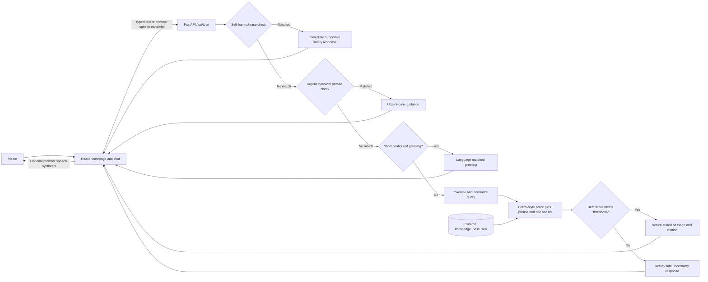

# Nia — a supportive first step

Nia is a private, welcoming web companion for people seeking a place to ask reproductive-health questions, talk through uncertainty, and find a thoughtful next step. The experience pairs a responsive React interface with a Python retrieval-augmented generation (RAG) API that grounds its answers in a small, curated knowledge library.

> **Project status:** Prototype for exploration and evaluation. It is not a healthcare provider, emergency service, or substitute for qualified medical or legal advice.

## The problem

Questions about pregnancy and reproductive health can be sensitive, emotionally difficult, and hard to raise with another person. Online information can be fragmented or confusing, and an unsupported answer can create harm. People need an approachable first place to express a question, receive respectful general information, and understand when a qualified professional is the right next contact.

## The solution

Nia offers a no-account chat experience that begins with an empty conversation, so the visitor starts with their own question. Short greetings have language-matched replies for a configured set of languages; health questions are matched against a wider topic library and answered from the closest passage with its source. A cautious fallback is used when no passage scores well enough. Urgent phrases take a separate path to encourage in-person help.

Nia is deliberately a starting point for information and reflection—not a diagnostic, prescribing, treatment, legal-eligibility, or crisis-response tool.

## Product flow

1. A visitor arrives at the homepage, learns why Nia exists, and opens the chat.
2. The visitor starts the conversation by typing, or selects **Call Nia**. A simulated six-second connection state is shown before the browser starts listening. This is a voice-chat interaction, not a telephone call.
3. In voice mode, speech recognition captures a phrase and submits it after the browser detects a pause. Nia answers aloud using a feminine-coded English system voice when the browser provides one; the exact voice depends on the browser and operating system.
4. The frontend sends the message to the local FastAPI endpoint.
5. The API checks for configured urgent phrases, then short greetings in its configured language list, and otherwise ranks the curated health entries against the message.
6. When a sufficiently relevant entry is found, Nia returns its stored guidance and source. If not, Nia uses the fallback response.
7. The frontend displays the response and source. In voice conversation mode, supported browsers can read the response aloud and resume listening.

## Backend RAG architecture

The current knowledge base is maintained as structured JSON rather than ingested from PDFs at runtime. It includes starter passages for pregnancy decisions and care, contraception, emergency contraception, STI/HIV, consent and relationships, menstrual and vaginal health, fertility, menopause, puberty, sexual function, and provider visits. Each entry contains response text, title, category, retrieval phrases and keywords, and source metadata, including its review status. The service loads these entries on startup. Retrieval indexes only titles, categories, phrases, and keywords—not the answer prose—then tokenizes the incoming message, computes a BM25-style lexical relevance score, adds phrase/title boosts, and selects the top-scoring entry. A minimum score threshold of `0.28` controls whether an answer is returned or the fallback is used. Explicit self-harm and urgent symptom phrase checks run before greeting detection and standard retrieval.



### Current request and response behavior

- `POST /api/chat` accepts a message and an optional, limited history payload. The current retrieval implementation ranks the latest message only; history is not used to rewrite or contextualize the answer.
- Short greetings matching the configured greeting list receive a concise reply in that language. This list is finite, not an all-language translation service.
- A matched response is returned from the knowledge entry as written, along with the entry’s source metadata.
- Queries below the relevance threshold return a fixed fallback without a citation.
- Configured self-harm phrases bypass RAG and return supportive immediate-safety guidance. This phrase check is limited and cannot replace crisis services.
- Configured urgent symptoms bypass standard retrieval and return general advice to seek urgent in-person care. This is a phrase check, not a complete or validated medical triage system.
- `GET /api/health` reports API status and the number of loaded knowledge entries.

## Prototype results

The current implementation provides a responsive landing page and empty-start chat, source-linked answers from the expanded local knowledge library, configured multilingual greeting replies, an explicit fallback for unsupported queries, and an urgent-phrase response path. Browser-based voice input/output is available only in compatible browsers and after permission is granted. The six-second call animation is a simulated connection delay; no phone call or human hotline is connected. A feminine-coded voice is selected only when the browser exposes a matching system voice, so the actual voice is platform-dependent.

The build and backend unit tests have been run successfully. The test suite covers representative health-topic retrieval, the specific pregnancy-after-sex routing case, self-harm escalation, configured multilingual greetings, a Kiswahili/Sheng-style query, the urgent phrase branch, and the unsupported-query fallback. These checks verify software behavior for those examples; they do not establish clinical safety, comprehensive language support, or real-world effectiveness.

## Project structure

```text
.
├── backend/
│   ├── main.py                 # FastAPI routes and local retrieval
│   ├── knowledge_base.json     # Curated answer passages and source metadata
│   ├── requirements.txt        # Python API dependencies
│   └── tests/                  # Backend behavior tests
├── frontend/
│   ├── index.html
│   ├── public/                 # Static assets
│   ├── src/
│   │   ├── App.jsx             # Homepage and hash-based chat navigation
│   │   ├── Chat.jsx            # Chat and browser voice interaction
│   │   ├── main.jsx            # React entry point
│   │   └── styles.css          # Responsive design system and page styles
│   └── vite.config.js          # Development proxy for /api
├── images/                     # Supplied visual references
├── package.json                # Root workspace scripts
└── README.md
```

## Run locally

Requirements: Node.js and npm, plus Python 3.14 or a compatible recent Python 3 version.

From the repository root, install the frontend and backend dependencies:

```bash
npm install
python3 -m venv .venv
.venv/bin/pip install -r backend/requirements.txt
```

Start the API and frontend in separate terminals:

```bash
npm run api
```

```bash
npm run dev
```

Open the Vite URL printed in the terminal (typically `http://localhost:5173`). The chat is available from the homepage and at `/#chat`. The API health endpoint is `http://localhost:8000/api/health`, and FastAPI’s interactive API documentation is at `http://localhost:8000/docs`.

Useful commands:

| Command | Purpose |
| --- | --- |
| `npm run dev` | Start the frontend development server |
| `npm run api` | Start the FastAPI backend with reload enabled |
| `npm run build` | Build the frontend for production |
| `npm run test:backend` | Run the backend unit tests |

## Deploy to Render

The backend API is deployed at `https://nia-2psd.onrender.com`. Production frontend builds use this URL by default, and Vite's development server continues to proxy `/api` to the local backend. You can override the production endpoint by setting `VITE_API_URL` in the frontend build environment. The repository also includes a Render Blueprint at `render.yaml` for creating the API and static frontend together; its frontend service gets the API URL from the API service's Render URL.

1. Push the project to GitHub. The repository is already configured with a GitHub remote.
2. Sign in to [Render](https://dashboard.render.com/) and choose **New → Blueprint**.
3. Connect the GitHub repository containing this project and select the `main` branch.
4. Review the `nia-api` and `nia-frontend` services, then apply the Blueprint. Render builds and deploys the API and website.
5. When deployment finishes, open the `nia-frontend` URL. Check the API health endpoint at the `nia-api` URL plus `/api/health`.

The API currently allows cross-origin browser requests because it has no cookies or user authentication. For production, set `CORS_ORIGINS` in the backend service to the exact frontend origin (for example, `https://nia-frontend.onrender.com`), then redeploy the API. Do not include a trailing slash. If a custom frontend domain is added, include that origin too. `CORS_ORIGINS` accepts a comma-separated list.

Render provides HTTPS, which is needed for browser microphone access on deployed sites. Speech recognition and synthesis still depend on browser support and the user's permissions. The six-second call state remains a simulated browser voice session; this setup does not provide a telephone number or real phone calls. On Render's free web-service plan, the API may spin down after inactivity and its first response after idle can be delayed.

The backend currently reads its JSON knowledge library from the deployed repository at startup. Changes pushed to the connected branch trigger Render builds/deploys; review Render's deploy logs if a service does not become healthy.

## Knowledge library maintenance

Update `backend/knowledge_base.json` to add or revise an answer. Each entry should include:

- A stable `id`, descriptive `title`, and `category`.
- Concise `content` that is safe to return directly to a visitor.
- Representative `phrases` and `keywords` used for retrieval.
- A `source` with title, URL, publisher, and review status.

The service reads the file at startup, so restart the API after edits. The bundled entries are starter content and require review before public use. Have locally qualified reproductive-health clinicians and legal/safeguarding reviewers verify the guidance, citations, translations, and referrals. Keep reviewer and review-date records as part of the content workflow. Do not treat search relevance or passing tests as validation of the source material.

## Privacy and safety considerations

- The prototype has no user accounts, database, or server-side conversation history. Chat messages exist in frontend memory during the open session and are sent to the API to retrieve a response; the current API does not persist them.
- The browser’s speech-recognition and speech-synthesis services may have privacy practices that differ from the local API. Voice features require a compatible browser and microphone permission.
- Do not enter identifying or highly sensitive details into the demo.
- The RAG library and urgent phrase list are limited. An urgent phrase may be missed, and a phrase match is not a medical assessment.
- Before deployment, complete clinical, legal, privacy, language, and safeguarding review. Establish verified local referral and emergency information; add appropriate abuse/threat testing, operational safeguards, HTTPS, and a documented privacy policy.

## Technology

- **Frontend:** React, Vite, and Lucide icons.
- **Backend:** Python, FastAPI, and Pydantic.
- **Retrieval:** Lightweight lexical BM25-style ranking over a curated JSON knowledge library.
- **Voice:** Browser Speech Recognition and Speech Synthesis where supported.
