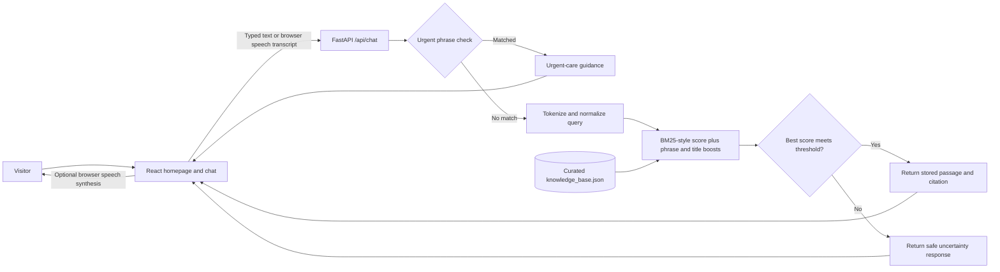

# Nia — a supportive first step

Nia is a private, welcoming web companion for people seeking a place to ask reproductive-health questions, talk through uncertainty, and find a thoughtful next step. The experience pairs a responsive React interface with a Python retrieval-augmented generation (RAG) API that grounds its answers in a small, curated knowledge library.

> **Project status:** Prototype for exploration and evaluation. It is not a healthcare provider, emergency service, or substitute for qualified medical or legal advice.

## The problem

Questions about pregnancy and reproductive health can be sensitive, emotionally difficult, and hard to raise with another person. Online information can be fragmented or confusing, and an unsupported answer can create harm. People need an approachable first place to express a question, receive respectful general information, and understand when a qualified professional is the right next contact.

## The solution

Nia offers a no-account chat experience with optional browser-based speech input and spoken replies. The interface is designed to be calm, mobile-friendly, and non-judgmental. On the backend, a local RAG flow finds the closest matching passage, returns it with its source, and uses a cautious fallback when the library does not contain a sufficiently relevant answer. Urgent phrases take a separate path to encourage in-person help.

Nia is deliberately a starting point for information and reflection—not a diagnostic, prescribing, treatment, legal-eligibility, or crisis-response tool.

## Product flow

1. A visitor arrives at the homepage, learns why Nia exists, and chooses to chat or use voice.
2. The visitor writes a message or speaks through their browser. Voice recognition transcribes speech into text before it is sent.
3. The frontend sends the message to the local FastAPI endpoint.
4. The API checks for configured urgent phrases. Otherwise, it ranks the curated knowledge entries against the message.
5. When a sufficiently relevant entry is found, Nia returns its stored guidance and source. If not, Nia uses the fallback response.
6. The frontend displays the response and source. In voice conversation mode, supported browsers can read the response aloud and resume listening.

## Backend RAG architecture

The current knowledge base is maintained as structured JSON rather than ingested from PDFs at runtime. Each entry contains response text, title, category, retrieval phrases and keywords, and source metadata, including its review status. The service loads these entries on startup. Retrieval tokenizes the incoming message, computes a BM25-style lexical relevance score, adds phrase/title boosts, and selects the top-scoring entry. A minimum score threshold of `0.28` controls whether an answer is returned or the fallback is used. Emergency phrase checks run before normal retrieval.



### Current request and response behavior

- `POST /api/chat` accepts a message and an optional, limited history payload. The current retrieval implementation ranks the latest message only; history is not used to rewrite or contextualize the answer.
- A matched response is returned from the knowledge entry as written, along with the entry’s source metadata.
- Queries below the relevance threshold return a fixed fallback without a citation.
- Configured urgent phrases bypass standard retrieval and return general advice to seek urgent in-person care. This is a phrase check, not a complete or validated medical triage system.
- `GET /api/health` reports API status and the number of loaded knowledge entries.

## Prototype results

The current implementation provides a responsive landing page and chat, source-linked answers from the local knowledge library, an explicit fallback for unsupported queries, and an urgent-phrase response path. Browser-based voice input/output is available only in compatible browsers and after permission is granted. No phone call or human hotline is connected.

The build and backend unit tests have been run successfully. The test suite currently covers example retrieval, a Kiswahili/Sheng-style query, the urgent phrase branch, and the unsupported-query fallback. These checks verify software behavior for those examples; they do not establish clinical safety, comprehensive language support, or real-world effectiveness.

## Project structure

```text
.
├── backend/
│   ├── main.py                 # FastAPI routes and local retrieval
│   ├── knowledge_base.json     # Curated answer passages and source metadata
│   ├── requirements.txt        # Python API dependencies
│   └── tests/                  # Backend behavior tests
├── frontend/
│   ├── index.html
│   ├── public/                 # Static assets
│   ├── src/
│   │   ├── App.jsx             # Homepage and hash-based chat navigation
│   │   ├── Chat.jsx            # Chat and browser voice interaction
│   │   ├── main.jsx            # React entry point
│   │   └── styles.css          # Responsive design system and page styles
│   └── vite.config.js          # Development proxy for /api
├── images/                     # Supplied visual references
├── package.json                # Root workspace scripts
└── README.md
```

## Run locally

Requirements: Node.js and npm, plus Python 3.14 or a compatible recent Python 3 version.

From the repository root, install the frontend and backend dependencies:

```bash
npm install
python3 -m venv .venv
.venv/bin/pip install -r backend/requirements.txt
```

Start the API and frontend in separate terminals:

```bash
npm run api
```

```bash
npm run dev
```

Open the Vite URL printed in the terminal (typically `http://localhost:5173`). The chat is available from the homepage and at `/#chat`. The API health endpoint is `http://localhost:8000/api/health`, and FastAPI’s interactive API documentation is at `http://localhost:8000/docs`.

Useful commands:

| Command | Purpose |
| --- | --- |
| `npm run dev` | Start the frontend development server |
| `npm run api` | Start the FastAPI backend with reload enabled |
| `npm run build` | Build the frontend for production |
| `npm run test:backend` | Run the backend unit tests |

## Knowledge library maintenance

Update `backend/knowledge_base.json` to add or revise an answer. Each entry should include:

- A stable `id`, descriptive `title`, and `category`.
- Concise `content` that is safe to return directly to a visitor.
- Representative `phrases` and `keywords` used for retrieval.
- A `source` with title, URL, publisher, and review status.

The service reads the file at startup, so restart the API after edits. The bundled entries are starter content and require review before public use. Have locally qualified reproductive-health clinicians and legal/safeguarding reviewers verify the guidance, citations, translations, and referrals. Keep reviewer and review-date records as part of the content workflow. Do not treat search relevance or passing tests as validation of the source material.

## Privacy and safety considerations

- The prototype has no user accounts, database, or server-side conversation history. Chat messages exist in frontend memory during the open session and are sent to the API to retrieve a response; the current API does not persist them.
- The browser’s speech-recognition and speech-synthesis services may have privacy practices that differ from the local API. Voice features require a compatible browser and microphone permission.
- Do not enter identifying or highly sensitive details into the demo.
- The RAG library and urgent phrase list are limited. An urgent phrase may be missed, and a phrase match is not a medical assessment.
- Before deployment, complete clinical, legal, privacy, language, and safeguarding review. Establish verified local referral and emergency information; add appropriate abuse/threat testing, operational safeguards, HTTPS, and a documented privacy policy.

## Technology

- **Frontend:** React, Vite, and Lucide icons.
- **Backend:** Python, FastAPI, and Pydantic.
- **Retrieval:** Lightweight lexical BM25-style ranking over a curated JSON knowledge library.
- **Voice:** Browser Speech Recognition and Speech Synthesis where supported.
